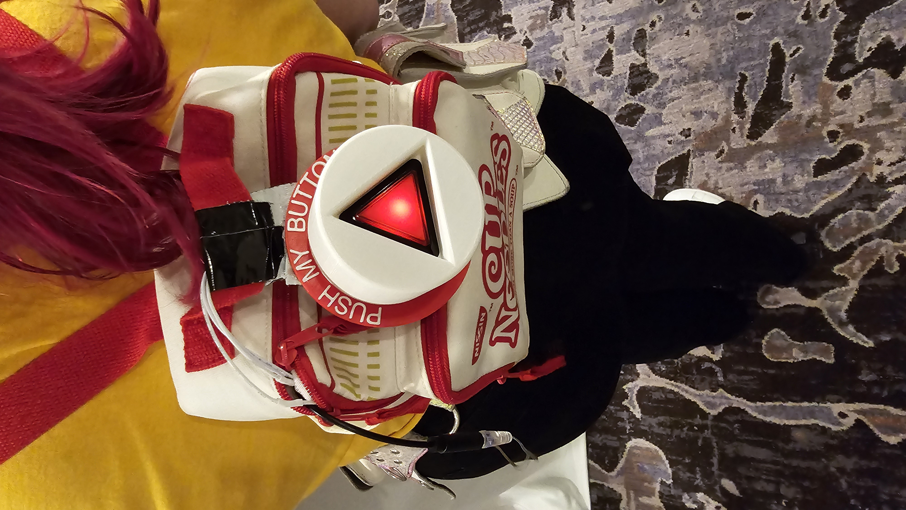

# Push My Button

The Push My Button is a backpack worn by a person, which has a button on it, and controls some stimulation.  The button is not reachable by the wearer, so they must ask other people to push it for them.  

## Background

This idea has been bouncing around my head for the last 10 years.  Specifically, I wanted to make a submissive interact with other people and have them turn them on.  It ended up spawning some other

## Building it

See readmes in hardware and software directories.

## Discussions and thoughts around consent

Consent is a very important topic in both the kinky community and broader society.  Because of the nature of this project, I feel it's important to talk about consent relating to this project.  

Demoing this project at DomCon 2024 brought up some interesting questions, concerns, and discussions around the topic of consent.  This will be filled out in more detail when time permits.  Suffice it to say: Make sure the wearer is fully aware of and consenting to the activity, and it's being done in a space where the people there will be consenting to seeing or interacting with this sort of thing (play party, etc.).  

## Versions

1. Adafruit Feather based version with a single button and single vibe. Coding was done in Circuit Python.
    1. Battery life was about 2 hours.
    1. Attaching the button to the backpack ended up being a challenge. Magnets was a nice thought for not damaing the backpack, but was too easily knocked off.
    1. Triggering the action should be done on button push vs button release.  I noticed many people pushing the button and holding it, waiting for a response.  After they noticed nothing happening and released, it would queue up the vibe, and they would get their response.  
    1. Putting in a cooldown for the button was a really good idea because soooo many people would just mash it a bunch of times.
    1. TODO: Power Management needs to be improved.
    1. TODO: When booting up and in an error state, the vibe goes to 100%.... I guess that's one way of getting someone's attention 0:-)  Obviously that needs to be fixed.  
    

## Feedback and future ideas

1. A dedicated backpack should be made which can house the button.  It should also be a little more rigid than most backpacks
1. Include a nice and meaningful display.  This would show the queue, along with what the recent button push added.  As well as some usage stats.  
1. Add a secondary stimulus.  Maybe an e-stim?  Maybe multiple vibes?
1. Add wifi connectivity.  Possibly running a webserver showing stats?
